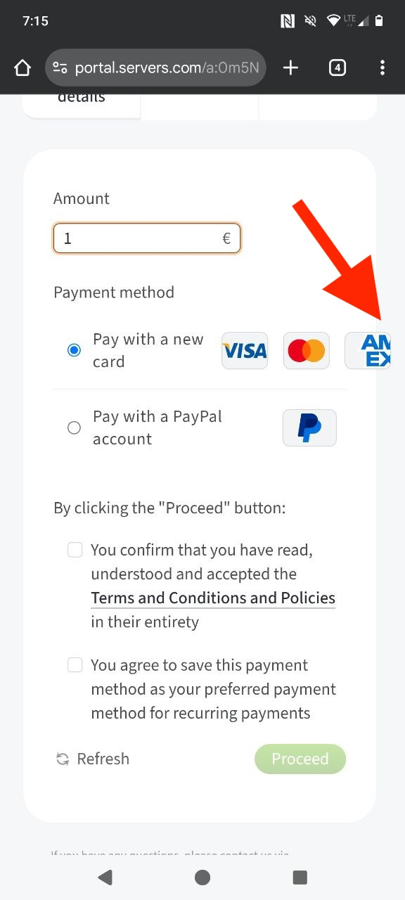
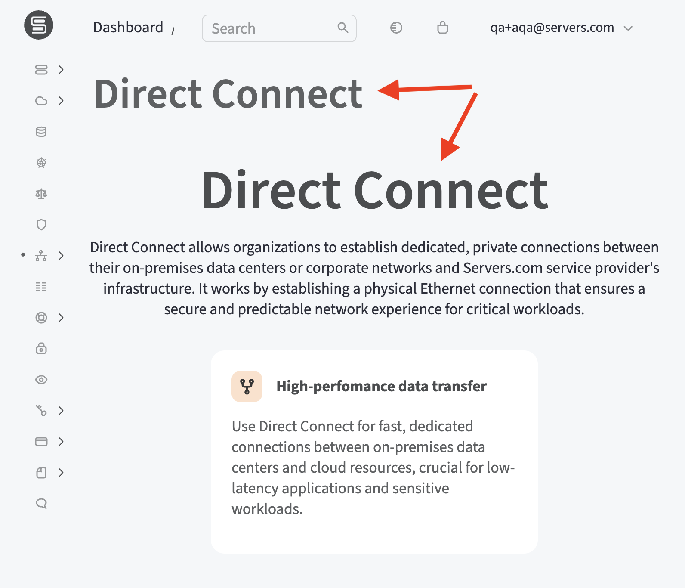
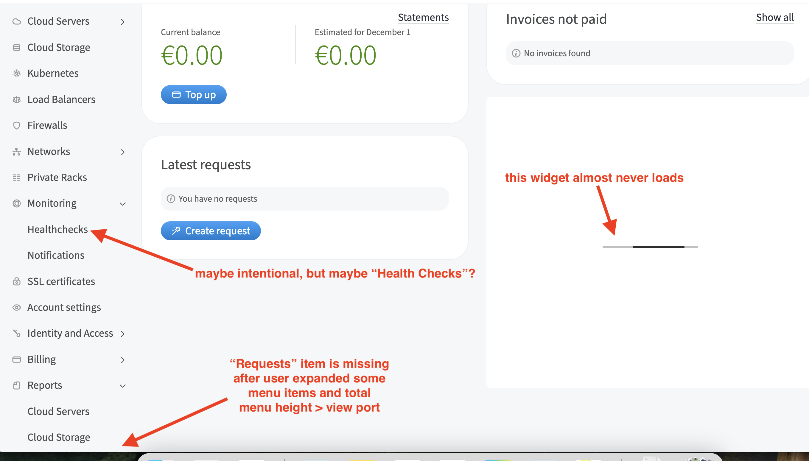
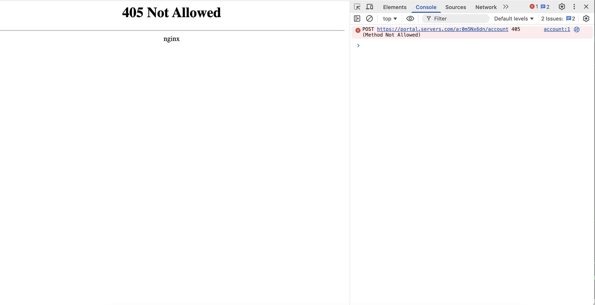

Simple WebUI Tests for servers.com
---

Playwright-based UI test automation using TypeScript and Page Object Model pattern.

The test suite covers the following scenarios:
- Login / Logout (including browser session persistence)
- Smoke tests for side menu navigation (with screenshot verification)
- Account Settings - Subscriptions CRUD operations (create, edit, delete contacts)


# Setup

1. Install Node.js (v18 or higher)

2. Install dependencies:
```bash
npm install
```

3. Install Playwright browsers:
```bash
npx playwright install
```

4. Create `.env` file with credentials:
```
QA_USER=your-email@example.com
QA_PASS=your-password

# Optional proxy settings
PROXY_SERVER=proxy.example.com:8080
PROXY_USER=proxy-username
PROXY_PASS=proxy-password
```

5. (Optional) Unpack reference screenshots:

If you have the password (same as `QA_PASS`), you can extract pre-made reference screenshots:
```bash
# Mac/Linux:
./scripts/unpack-screenshots.sh

# Windows (PowerShell):
powershell -ExecutionPolicy Bypass -File scripts/unpack-screenshots.ps1

# Or manually with any zip tool:
unzip -P <password> screenshots.zip
```

If you don't have the password, create your own reference screenshots (see "How To Run" section).

# How To Run

Run all UI tests in a desktop browser (good for debugging and demo):
```bash
npx playwright test --project=desktop-large --headed
```

Run all tests with mobile device simulation:
```bash
MOBILE_DEVICE="iPhone 15 Pro Max" npx playwright test --project=mobile --headed
```

Run only login and logout tests:
```bash
npx playwright test login_and_logout
```

Run smoke tests for side menu in a small browser window:
```bash
npx playwright test smoke_menu --project=desktop-small
```

Run subscriptions (contacts) CRUD tests:
```bash
npx playwright test subscriptions --project=desktop-large --headed
```

View test report:
```bash
npx playwright show-report
```

Update reference screenshots:
```bash
npx playwright test --update-snapshots --project=desktop-large
```


# Limitations

Tests cannot run in parallel because the server detects concurrent sessions as suspicious activity and returns 403 errors. My IP was banned during development, so tests are run via proxy. There is still a limitation on concurrent active sessions.

To work around this, side menu smoke tests share a single authenticated session to speed up execution.

# Found Bugs

Several issues were found while creating automated tests:

1. **Performance**: The WebUI is slow - login takes 10+ seconds for a simple empty test account. Page navigation takes several seconds even on repeat visits. Running the test suite consumes 100MB+ of traffic, indicating room for optimization.

2. **Responsive design**: The WebUI is not properly adapted for mobile and small desktop screens. UI elements overflow their containers and extend outside the viewport.

[](./bugs/mobile_ux.jpeg)

3. **Duplicate headers**: Many pages have redundant headers. Consider removing large headers on pages with only one content block.

[](./bugs/duplicated_headers.png)

4. **JS errors**: Multiple JavaScript errors appear during test execution, mostly related to external service integrations.

5. **Menu overflow**: The "Reports" menu item becomes inaccessible on desktop when all other expandable menu items are open (menu has a height limit that hides overflow items).

[](./bugs/menu_items.png)

7. **Inconsistent naming**: Sub-menu items use inconsistent capitalization - "Cloud Servers" vs "Group invoices" and "Top up balance". Also, "Healthchecks" is written without a space - is this intentional?

8. It is not possible to search Subscriptions (contacts) by full name (e.g., "John Doe"). Users must search by first name or last name separately.

9. When clicking the Delete confirmation button quickly while deleting Subscriptions in Account Settings, JavaScript event handlers may not attach in time, resulting in a 405 error:

[](./bugs/405.png)

10. Users can create new account memberships but cannot remove them (in User Profile).


# Project Structure

```
tests/
  login_and_logout.spec.ts   - Authentication tests
  smoke_menu.spec.ts         - Side menu navigation tests
  subscriptions.spec.ts      - Subscriptions CRUD tests
src/
  pages/                     - Page Object Model classes
    BasePage.ts              - Base class with common utilities
    LoginPage.ts             - Login page interactions
    DashboardPage.ts         - Dashboard page interactions
    SideMenuComponent.ts     - Side menu navigation component
    AccountSettingsPage.ts   - Account Settings subscriptions widget
    NewContactPage.ts        - New/Edit contact form
    ContactInfoPage.ts       - Contact detail page
    index.ts                 - Barrel export
  utils.ts                   - Shared test utilities
  menu-data.ts               - Menu structure definition
scripts/
  pack-screenshots.sh        - Pack screenshots into encrypted archive
  unpack-screenshots.sh      - Unpack screenshots from archive
playwright.config.ts         - Playwright configuration
tsconfig.json                - TypeScript configuration
eslint.config.mjs            - ESLint configuration
.prettierrc                  - Prettier configuration
.env                         - Credentials (not committed)
screenshots.zip              - Encrypted reference screenshots
```

# Development

Run linting:
```bash
npm run lint
```

Format code:
```bash
npm run format
```

Type check:
```bash
npm run typecheck
```
